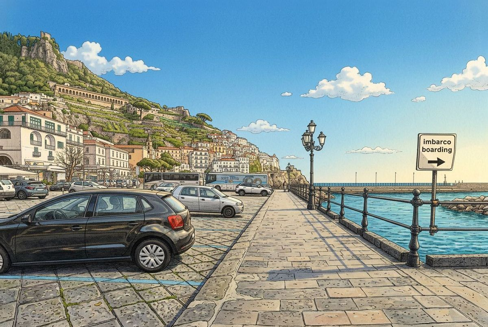

# find.amalfi.day

  

`find.amalfi.day` is a private, offline-first navigation guide for guests on the Amalfi Coast. It turns a difficult real-world walk through Amalfi, Atrani, tunnels, narrow streets, stairs, restaurants, arches, and small local landmarks into a calm step-by-step mobile experience.

The project is built around one simple idea: when a guest is tired, carrying luggage, switching between ferry, bus, Booking.com, Airbnb, WhatsApp, weak mobile signal, and unfamiliar streets, the guide should not feel like software. It should feel like somebody local is walking just ahead and pointing at the next visible thing.

This is not a starter template and not a general-purpose route app. The content, images, routes, copy, PDFs, and interaction details are tied to Gregory's real guest journey in Atrani and Amalfi.

## What It Does

- Guides guests from Amalfi or Atrani to Gregory's House.
- Guides guests from Amalfi to the CristallPont Amalfi Day meeting point.
- Works as an installable PWA, so the guide can be saved to the phone before the walk.
- Keeps route pages, photos, translations, icons, and core assets available offline through a Service Worker.
- Shows each route as large photo-based steps with short captions, progress, and next/back controls.
- Supports English, Italian, German, French, Russian, and Chinese.
- Provides downloadable PDF guides for every route and language as a backup.
- Includes a fullscreen photo viewer, swipe navigation, keyboard navigation, text-to-speech, haptics, scroll restoration, and a bottom-sheet step drawer.
- Surfaces practical arrival details such as Wi-Fi and copyable passwords where relevant.

## Routes

| Experience | Entry point | Route | Current structure |
|---|---:|---|---|
| Gregory's House | `/` | Amalfi -> Gregory's House | 33 photo steps |
| Gregory's House | `/` | Atrani -> Gregory's House | 21 photo steps |
| Meeting Point | `/a/` | Amalfi -> Meeting Point | 14 photo steps |
| Meeting Point | `/a/` | Atrani -> Meeting Point | Short inline route on the meeting page |

The routes are composed from reusable real-world segments:

| Segment | Meaning | Role |
|---|---|---|
| `seg-a` | Amalfi -> Atrani | Shared beginning for routes that start in Amalfi |
| `seg-b` | Atrani -> Gregory's House | Main final leg to the house |
| `seg-b-alt` | Atrani bus stop -> village path | Alternate beginning for guests arriving directly in Atrani |
| `seg-c` | Atrani -> Meeting Point | Meeting-point-specific local path |

This segment model keeps the project accurate without duplicating the same walk in multiple places. If a landmark changes, the affected segment can be updated once and reused across the routes that depend on it.

## Visual System

All route images are generated from real photographs with Nanobanana 2. They are not decorative illustrations. The source is the actual route: the ferry port, tunnel entrances, restaurant terraces, streets, arches, doors, stairs, shopfronts, and house arrival points.

The generated visual style is used for usability:

- Landmarks stay recognizable, but visual noise is reduced.
- Lighting and contrast become more consistent from step to step.
- Photos feel like one coherent guide instead of a mixed camera roll.
- Important route cues are easier to scan outdoors on a phone screen.
- The experience feels calmer for a guest who may be navigating with luggage or low battery.

The design language is intentionally practical: large photos, short captions, clear progress, high contrast, big touch targets, minimal menus, persistent route controls, and a warm Mediterranean palette. The style choices are there to make the route easier, not to decorate the interface.

## User Experience

The guide is optimized for a mobile-first walking situation:

- A guest opens a link from Gregory, Airbnb, Booking.com, or WhatsApp.
- The landing page asks only where the guest is starting from.
- The route page becomes a sequence of visible decisions: "look for this", "turn here", "continue through this tunnel", "climb these steps".
- The progress rail shows the current section of the journey, for example Amalfi, Atrani, House, Tunnel, or Meeting Point.
- The bottom controls let the guest move one step at a time without hunting through the page.
- The drawer gives a quick visual overview of all steps with thumbnails.
- The lightbox lets the guest zoom into a photo when a local detail is hard to see.
- Text-to-speech can read the step aloud when looking down at the phone is inconvenient.
- Offline caching protects the experience in weak-signal areas and tunnels.

## Technology

| Layer | Technology | Why it fits this project |
|---|---|---|
| Frontend | Static HTML5 | Fast, reliable, easy to host, and perfect for a small set of route pages |
| Styling | Vanilla CSS with design tokens | Keeps the interface lightweight while allowing a consistent visual system |
| Logic | Vanilla JavaScript | Enough for navigation, i18n, offline behavior, drawers, TTS, haptics, and lightbox without framework weight |
| Offline | Service Worker and Cache API | Critical for the Amalfi Coast, where signal can disappear around mountains and inside tunnels |
| Installability | Web App Manifest | Lets guests save the guide to the home screen like a small app |
| Images | Sharp-generated WebP with JPEG fallback | Small, fast images with compatibility for browsers that need fallback assets |
| PDFs | `pdf-lib`, `fontkit`, embedded Noto fonts | Generates printable multilingual backups, including Cyrillic and Chinese text support |
| Icons | Lucide | Familiar, readable icons without a heavy UI framework |
| Translations | JSON dictionaries | Keeps copy, captions, alt text, and UI labels editable by language |
| Analytics | Google Analytics and Vercel Web Analytics | Helps understand whether guests reach and use the guide successfully |
| Deployment | GitHub Actions and Vercel | Supports dev previews, staging, production releases, and cleanup of preview deployments |

The main technical decision is the absence of a frontend framework. For this product, that is a strength. The guide needs to be fast, resilient, cacheable, simple to inspect, and dependable on a guest's phone. A framework would add moving parts without improving the core job: show the right photo and instruction at the right moment.

## Content Pipeline

The project has an internal generation pipeline:

- Route HTML is generated from segment definitions.
- Images are processed into optimized main files, thumbnails, WebP files, and JPEG fallbacks.
- PDF guides are generated per route and per language.
- Translations live in language-specific JSON files.
- The Service Worker precaches the core route experience for offline use.

This gives the project a useful balance: the guest sees a simple static site, while the source stays maintainable enough to update routes, images, and languages as the real world changes.

## Future Direction

The next major direction is location-aware guidance, but designed carefully for the actual Amalfi environment.

### Geolocation

A practical first version would be a "Where am I?" action on route pages:

- The app asks for the current GPS position only when the guest taps the button.
- It compares the position with known route points and jumps to the nearest step.
- It shows an accuracy state, because GPS may be precise at the harbor and unreliable in tunnels or narrow Atrani streets.
- It keeps the decision human-friendly: "you are probably near step 17" rather than pretending to be perfectly certain.
- It works offline because the route coordinates can be bundled with the PWA.

This is better than continuous tracking for this route. Continuous GPS can jump around in tunnels and dense stone streets, drain battery, and make the interface feel nervous. A one-tap position check respects the guest's attention and the limits of the place.

### Invisible Route Markers

An even more interesting extension is subtle physical or contextual markers along the route:

- Tiny NFC tags, discreet QR markers, or visual anchors placed only where permission and context allow.
- Markers that are not obvious to passersby but can confirm a precise route step for the guide.
- A scan or tap could instantly move the guide to the correct step without relying on GPS.
- Hidden markers would be especially useful in tunnels, under arches, and in narrow streets where satellite positioning is weak.
- The guide could combine marker confirmation with GPS and route progress to make navigation feel almost automatic.

The goal is not to turn the walk into a map. The goal is to make the guide quietly aware of the guest's progress while keeping the interface simple.

## Philosophy

The best route guide is not the one with the most features. It is the one that lowers stress at the exact moment the user needs help.

`find.amalfi.day` is built for that moment: a guest arrives on the Amalfi Coast, opens one link, sees one clear choice, follows real visual landmarks, and gets to the right place without needing to understand the local geography first.

## Credits

Created by Gregory, Claude, Codex, and Nanobanana.

Visual generation from real route photography: Nanobanana 2.

Route knowledge, product direction, and guest experience: Gregory.

Engineering, structure, copy, and implementation support: Claude and Codex.

Also: Грегори, Клод, Кодекс и Нанобанана.
