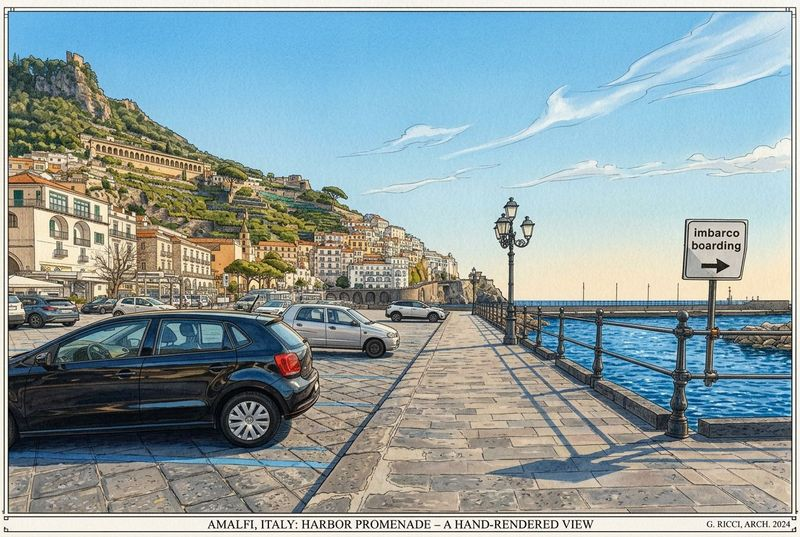

# find.amalfi.day — Guest Navigation PWA

## Project Brief

Offline-first Progressive Web App for Airbnb guests to navigate from arrival points (Amalfi / Atrani) to two accommodation locations on the Amalfi Coast. Replaces an outdated PDF guide with a modern, photo-based step-by-step walkthrough that works without internet in tunnels and mountain areas.

**Domain:** `find.amalfi.day`  
**Owner:** CristallPont S.r.l. / Greg  
**Hosting:** Same server as amalfi.day  

---

## Destinations & Routes

### Two Destinations

| URL | Name | Description |
|-----|------|-------------|
| `find.amalfi.day` | Greg's House | Primary accommodation |
| `find.amalfi.day/a` | Meeting Point "Awesome" | Second meeting point |

### Two Starting Points

| Starting Point | Typical Arrival |
|----------------|-----------------|
| **Amalfi** | Ferry port / bus stop (same area) |
| **Atrani** | Bus stop (closer to destinations) |

### Route Segments (Key Insight)

Routes from Amalfi share a **common initial segment** to Atrani. This means we have **3 unique segments**, not 4:

```
Segment A:  Amalfi → Atrani          (common beginning)
Segment B:  Atrani → Greg's House    (final leg to destination 1)
Segment C:  Atrani → Awesome Point   (final leg to destination 2)
```

**Composite routes:**

| Route | Segments | Photos |
|-------|----------|--------|
| Amalfi → Greg's House | A + B | ~30-40 steps |
| Atrani → Greg's House | B only | ~15-20 steps |
| Amalfi → Awesome Point | A + C | ~30-40 steps |
| Atrani → Awesome Point | C only | ~15-20 steps |

Photos from Segment A are reused — no duplication needed.

---

## Technology Stack

### Static PWA (HTML/CSS/JS) — No Framework

**Rationale:** Maximum reliability, zero dependencies, universal browser support. Few pages, static content, critical offline requirement — a framework adds complexity with no benefit.

| Layer | Technology | Why |
|-------|-----------|-----|
| Markup | Vanilla HTML5 | Universal support, no build step |
| Styling | Vanilla CSS (custom properties) | No Tailwind/PostCSS build needed |
| Logic | Vanilla JS (ES6) | Service Worker API, i18n switching |
| Offline | Service Worker (Cache API) | Precache all assets on first visit |
| Installable | Web App Manifest | "Add to Home Screen" on iOS/Android |
| Images | WebP with JPEG fallback | `<picture>` element, 60-70% size savings |
| PDF | Pre-generated per route | Download button, mobile-optimized layout |
| Hosting | Static files on existing server | Nginx, same as amalfi.day |

### Why NOT:

| Option | Rejection Reason |
|--------|-----------------|
| React/Vue/Svelte | Overkill for 5-6 static pages, adds bundle size |
| Astro | Good but unnecessary build step for this scope |
| Native app | App Store friction, maintenance burden |
| AMP | Too restrictive, no offline support |
| Simple PDF | Not interactive, no offline caching, not modern |

---

## Information Architecture

```
find.amalfi.day/
│
├── index.html                  ← Landing: Greg's House (choose starting point)
├── a/index.html                ← Landing: Awesome Point (choose starting point)
│
├── route/amalfi-house.html     ← Full walkthrough: Amalfi → Greg's House
├── route/atrani-house.html     ← Full walkthrough: Atrani → Greg's House
├── route/amalfi-awesome.html   ← Full walkthrough: Amalfi → Awesome Point
├── route/atrani-awesome.html   ← Full walkthrough: Atrani → Awesome Point
│
├── img/
│   ├── hero/                   ← Hero images for landing pages
│   ├── seg-a/                  ← Segment A photos (Amalfi → Atrani)
│   │   ├── 01.webp
│   │   ├── 01.jpg              ← JPEG fallback
│   │   └── ...
│   ├── seg-b/                  ← Segment B photos (Atrani → Greg's House)
│   └── seg-c/                  ← Segment C photos (Atrani → Awesome)
│
├── pdf/
│   ├── amalfi-to-house-en.pdf
│   ├── atrani-to-house-en.pdf
│   ├── amalfi-to-awesome-en.pdf
│   ├── atrani-to-awesome-en.pdf
│   └── ... (per language)
│
├── i18n/
│   ├── en.json                 ← English strings
│   ├── it.json                 ← Italian strings
│   ├── de.json                 ← German strings
│   └── fr.json                 ← French strings
│
├── css/
│   └── style.css               ← Single stylesheet
│
├── js/
│   ├── app.js                  ← Main logic, i18n, navigation
│   └── sw.js                   ← Service Worker
│
├── manifest.json               ← PWA manifest
├── favicon.ico
└── icons/                      ← PWA icons (192x192, 512x512)
```

---

## Multilingual System

### Languages

| Code | Language | Priority |
|------|----------|----------|
| `en` | English | Default fallback |
| `it` | Italiano | — |
| `de` | Deutsch | — |
| `fr` | Français | — |

### Detection Logic

```
1. Check URL parameter ?lang=xx        → use if valid
2. Check saved preference (cookie)      → use if exists
3. Check navigator.language             → match to supported
4. Fallback                             → English
```

### Implementation

All UI text lives in JSON files. Photo captions / step descriptions are also in JSON (not hardcoded in HTML). Language switch is a small flag/label selector in the header — persists via cookie.

```json
// i18n/en.json
{
  "hero_title": "Finding Greg's House",
  "hero_subtitle": "Step-by-step walking guide",
  "choose_start": "Where are you coming from?",
  "from_amalfi": "From Amalfi",
  "from_atrani": "From Atrani",
  "walk_time": "~15 min walk",
  "step": "Step",
  "of": "of",
  "download_pdf": "Save as PDF",
  "offline_ready": "Ready for offline use!",
  "tldr_title": "Quick Summary",
  "next": "Next",
  "prev": "Back",
  "segments": {
    "seg-a": {
      "01": { "caption": "Exit the ferry terminal and turn right" },
      "02": { "caption": "Walk along the waterfront promenade" }
    }
  }
}
```

---

## UX Flow

### Guest Journey

```
Guest receives link from Greg (WhatsApp/Airbnb message)
        ↓
Opens find.amalfi.day (or /a)
        ↓
   ┌─────────────────────────────────────┐
   │          HERO SCREEN                │
   │                                     │
   │   [Beautiful Amalfi Coast photo]    │
   │                                     │
   │   🏠 Finding Greg's House          │
   │                                     │
   │   TLDR: "15 min walk from Amalfi.   │
   │   Follow the coastal road through   │
   │   the tunnel to Atrani, then up     │
   │   the stairs."                      │
   │                                     │
   │   Where are you coming from?        │
   │                                     │
   │   ┌─────────┐  ┌──────────┐        │
   │   │ AMALFI  │  │  ATRANI  │        │
   │   │ ~15 min │  │  ~8 min  │        │
   │   └─────────┘  └──────────┘        │
   │                                     │
   │   🌐 EN | IT | DE | FR             │
   │                                     │
   │   💾 Save for offline              │
   └─────────────────────────────────────┘
        ↓
   ┌─────────────────────────────────────┐
   │        STEP-BY-STEP ROUTE           │
   │                                     │
   │   Step 3 of 18                      │
   │   ━━━━━━━━━━░░░░░░░░░░  (progress) │
   │                                     │
   │   ┌─────────────────────────────┐   │
   │   │                             │   │
   │   │      [PHOTO: wide view]     │   │
   │   │                             │   │
   │   └─────────────────────────────┘   │
   │                                     │
   │   "Enter the tunnel. Stay on the    │
   │    left sidewalk. The tunnel is     │
   │    about 200m long."               │
   │                                     │
   │   ┌────────┐        ┌─────────┐    │
   │   │  ← Back │        │ Next →  │    │
   │   └────────┘        └─────────┘    │
   │                                     │
   │   📄 Download PDF                   │
   └─────────────────────────────────────┘
```

### Key UX Decisions

- **Vertical scroll OR swipe** — support both; each step is a "card"
- **Progress bar** — always visible, shows current step / total
- **Large photos** — full-width, minimum height 50vh
- **Big touch targets** — buttons minimum 48px, easy to tap while walking
- **High contrast text** — dark text on light background, readable in sunlight
- **No hamburger menus** — everything visible, one tap away
- **Auto-save scroll position** — if user switches apps, return to same step

---

## Offline Strategy

### Service Worker: Cache-First

```
INSTALL event:
  → Precache: all HTML, CSS, JS, JSON, icons, manifest
  → Precache: ALL route photos (seg-a, seg-b, seg-c)
  → Precache: PDF files
  → Total estimated cache: 15-25 MB

FETCH event:
  → Try cache first
  → If miss → try network
  → If network fails → show offline fallback
```

### Aggressive Precaching

Because users WILL lose connectivity (tunnels, mountains), we cache everything upfront. The tradeoff is a larger initial load (15-25 MB), but after that it's 100% offline.

### Cache Management

```javascript
const CACHE_VERSION = 'find-amalfi-v1';
const PRECACHE_URLS = [
  '/',
  '/a/',
  '/route/amalfi-house.html',
  '/route/atrani-house.html',
  '/route/amalfi-awesome.html',
  '/route/atrani-awesome.html',
  '/css/style.css',
  '/js/app.js',
  '/i18n/en.json',
  '/i18n/it.json',
  '/i18n/de.json',
  '/i18n/fr.json',
  '/manifest.json',
  // + all images dynamically listed
];
```

### Smart Loading UX

On first visit, show a loading indicator: "Downloading guide for offline use... 73%". Once complete, show a green checkmark: "✓ Ready for offline use!" This sets expectations and reassures guests.

---

## Image Optimization Pipeline

### Processing Steps

```bash
# For each source photo:
1. Resize to max 800px width (portrait photos: max 800px height)
2. Export WebP at quality 75 → img/seg-x/NN.webp
3. Export JPEG at quality 80 → img/seg-x/NN.jpg (fallback)
4. Generate thumbnail 400px → img/seg-x/NN-thumb.webp (for lazy load)
```

### Expected Sizes

| Format | Per photo | 60 photos total |
|--------|-----------|-----------------|
| WebP 800px | ~60-100 KB | ~4-6 MB |
| JPEG 800px | ~100-160 KB | ~7-10 MB |
| Thumbnail 400px | ~15-25 KB | ~1-1.5 MB |

**Total cache estimate: ~12-18 MB** (WebP primary + thumbnails + HTML/CSS/JS/JSON)

### HTML Usage

```html
<picture>
  <source srcset="img/seg-a/01.webp" type="image/webp">
  
</picture>
```

---

## PDF Generation

### Approach

Pre-generate PDFs for each route × language combination (4 routes × 4 languages = 16 PDFs). Mobile-optimized: portrait A5 format, one step per page, large photo + caption.

### Generation Tool

Use Puppeteer or wkhtmltopdf to render route HTML pages → PDF. Alternatively, generate with a Node.js script (pdfkit or similar). PDFs are static assets served alongside the app.

### File Naming

```
pdf/amalfi-house-en.pdf
pdf/amalfi-house-it.pdf
pdf/atrani-house-en.pdf
pdf/atrani-awesome-fr.pdf
...
```

---

## Nginx Configuration

```nginx
server {
    server_name find.amalfi.day;

    root /var/www/find.amalfi.day;
    index index.html;

    # PWA: serve index.html for clean URLs
    location / {
        try_files $uri $uri/ $uri/index.html =404;
    }

    # Aggressive caching for images (they never change)
    location /img/ {
        expires 1y;
        add_header Cache-Control "public, immutable";
    }

    # Cache PDFs
    location /pdf/ {
        expires 30d;
        add_header Cache-Control "public";
    }

    # Service Worker must NOT be cached
    location /js/sw.js {
        expires -1;
        add_header Cache-Control "no-store, no-cache, must-revalidate";
    }

    # HTTPS (certbot / existing setup)
    listen 443 ssl;
    ssl_certificate     /path/to/cert;
    ssl_certificate_key /path/to/key;
}
```

---

## PWA Manifest

```json
{
  "name": "Find Greg's Place — Amalfi Coast",
  "short_name": "Find Greg's",
  "description": "Walking directions to your accommodation",
  "start_url": "/",
  "display": "standalone",
  "background_color": "#ffffff",
  "theme_color": "#1a5276",
  "orientation": "portrait",
  "icons": [
    { "src": "/icons/icon-192.png", "sizes": "192x192", "type": "image/png" },
    { "src": "/icons/icon-512.png", "sizes": "512x512", "type": "image/png" },
    { "src": "/icons/icon-512-maskable.png", "sizes": "512x512", "type": "image/png", "purpose": "maskable" }
  ]
}
```

---

## Development Phases

### Phase 1 — Foundation & Content Prep
- [ ] Set up project directory structure
- [ ] Create image optimization script (Sharp / ImageMagick)
- [ ] Process all photos → WebP + JPEG + thumbnails
- [ ] Write step descriptions for all 3 segments (EN)
- [ ] Translate to IT, DE, FR
- [ ] Create i18n JSON files

### Phase 2 — Core PWA
- [ ] Build landing pages (/ and /a) with hero + route selector
- [ ] Build route pages with step-by-step photo carousel
- [ ] Implement i18n system (language detection + switcher)
- [ ] Implement Service Worker with full precaching
- [ ] Add PWA manifest + icons
- [ ] Add progress bar and navigation between steps
- [ ] Test offline functionality

### Phase 3 — PDF & Polish
- [ ] Generate PDF for each route × language
- [ ] Add "Download PDF" button to each route page
- [ ] Add "Save for offline" prompt with progress indicator
- [ ] Add "Add to Home Screen" prompt
- [ ] Polish responsive design (test on various phones)
- [ ] Test in low-connectivity conditions

### Phase 4 — Deploy
- [ ] Configure DNS: find.amalfi.day → server
- [ ] Set up Nginx config with caching rules
- [ ] SSL certificate (Let's Encrypt)
- [ ] Test all routes on iOS Safari, Android Chrome, Samsung Internet
- [ ] Test offline in real conditions (walk the route!)

---

## Content Needed From Greg

### Photos (organized by segment)

```
photos/
├── hero/           ← 1-2 beautiful wide shots for landing pages
├── seg-a/          ← Amalfi → Atrani steps (numbered 01, 02, ...)
├── seg-b/          ← Atrani → Greg's House steps (numbered 01, 02, ...)
└── seg-c/          ← Atrani → Awesome Point steps (numbered 01, 02, ...)
```

**Photo guidelines:**
- Landscape orientation preferred (fills phone screen width better)
- Clear, well-lit (taken during daytime)
- Show landmarks, turns, signs — anything that helps orientation
- Include "arrow" shots showing which direction to go
- Name files in order: `01.jpg`, `02.jpg`, etc.

### Text for each step

For each photo, a short description (1-2 sentences), e.g.:
- "Exit the ferry terminal and turn right along the waterfront"
- "Enter the tunnel. Stay on the left sidewalk (~200m)"
- "After the tunnel, take the first staircase on your right"

Provide in English — I'll help translate to IT/DE/FR.

### TLDR summary per destination

A 2-3 sentence quick overview for each destination, e.g.:
- Greg's House: "15-minute walk from Amalfi. Follow the coastal road through the tunnel, enter Atrani, and climb the stairs past the church."
- Awesome Point: "12-minute walk from Amalfi. Same route to Atrani, then follow the signs to the piazza."

---

## Technical Notes

### Browser Support Target

| Browser | Version | Market Share (tourists) |
|---------|---------|----------------------|
| iOS Safari | 15+ | ~45% |
| Chrome Android | 90+ | ~40% |
| Samsung Internet | 16+ | ~8% |
| Firefox Android | 100+ | ~3% |
| Other | — | ~4% |

Service Worker support: all of the above. WebP support: all of the above (Safari 14+).

### Performance Budget

| Metric | Target |
|--------|--------|
| First load (with cache) | < 8 seconds on 3G |
| Subsequent loads | < 1 second (all cached) |
| Total cache size | < 25 MB |
| Largest Contentful Paint | < 3 seconds |
| Per-photo load | < 150 KB (WebP) |

### Accessibility

- Minimum font size: 16px
- Touch targets: minimum 48×48px
- Alt text on all photos
- Sufficient color contrast (WCAG AA)
- Works without JavaScript (basic HTML content visible)
